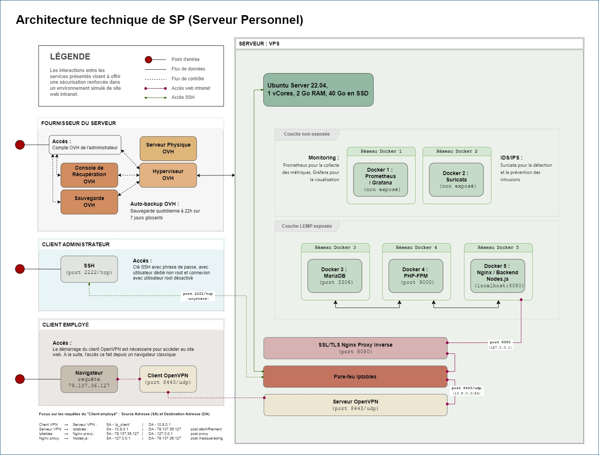

# Document d'Architecture Technique et Rapport de configuration du serveur _"SP"_
Tiffany Vernet - V1.0 - dernière modification le {docdate}
:title-page:
:sectnumlevels: 4
:toclevels: 4
:sectnums: 4
:toc: left
:icons: font
:toc-title: Sommaire

<<<
## Préambule

### Contexte

Le serveur SP et la présente documentation n'ont pas vocation à reproduire les différentes formes de serveurs ou documentation que l'on peut retrouver en entreprise et ne peuvent retranscrire les problématiques de sécurité propre à une activité professionnelle réelle.

Ils sont conçus dans un parcours d'autoformation afin d'éprouver quelques grands principes de sécurisation des systèmes d'information et d'en documenter les choix dans un but d'information et de maintenance.

De même, il faut considéré que le serveur SP est un laboratoire personnel et qu'à ce titre, il se doit d'être particulièrement scalable et ne prévoit pas de forme finalisée à ce jour. +

### Référence

La partie DAT de ce document est initialement inspirée par le modèle de dossier d'architecture proposé par Bertrand Florat et contributeurs consultable à ce lien : https://github.com/bflorat/modele-da[dépôt GitHub modèle DA], section https://github.com/bflorat/modele-da/blob/master/vue-architecture-securite.adoc[vue architecture sécurité]. 

Il a toutefois été considérablement modifié et simplifié.

Licence https://creativecommons.org/licenses/by-sa/4.0/[CC BY-SA 4.0] 

<<<
## Document d'Architecture Technique (DAT)

### Définition et architecture du projet

#### Objectifs et périmètre

Le serveur SP est une configuration LEMP qui a vocation à simuler un faux site intranet. L'objectif de ce projet n'est pas de développer une solution intranet complète, mais uniquement de configurer son déploiement manuellement, de la sécuriser et enfin d'en assurer la maintenance.
La solution ne prévoit pas à ce stade d'intégrer des applications de simulation de mutualisation de ressources, données, services de messagerie, etc.    

#### Schéma d'architecture technique

#### Étapes et notions 

Liste résumée des étapes d’exécution du projet : 

****
* Planification et définition des besoins et des objectifs du projet 
* Selection du fournisseur de serveur physique
* Mise en place du VPS ;
** Choix du système d'exploitation 
** Configuration réseau et règles de sécurité de base
* Sécurisation de l'accès au serveur ;
** Configuration d'un tunnel VPN 
** Mise en place d'un accès SSH par clés de chiffrement 
* Déploiement et configuration de la plateforme de conteneurisation
* Mise en place des conteneurs ;
** Conteneur 1 (exposé) : Mise en place d'un serveur web reverse proxy 
** Conteneur 2 (exposé) : Configuration d'un interpréteur PHP-FPM   
** Conteneur 3 (exposé) : Déploiement de la base de donnée
** Conteneur 4 (non exposé) : Mise en place d'une solution de monitoring
** Conteneur 5 (non exposé) : Mise en d'une solution IDS/IPS  
* Configuration de la pile LEMP (Linux, Nginx, MariaDB, PHP)
* Gestion des accès et droits utilisateurs
* Assurance de la maintenance 
* Création d'une interface web basique pour simulation Intranet
* Rédaction et mise à jour d'une documentation 
****

#### Politique de sécurité

En termes de sécurité, le serveur SP est construit sur une méthode rigoureuse qui comprend l'évaluation des risques, l'application de principes de moindre privilège et de défense en profondeur. J'ai mis en œuvre des mesures telles que le chiffrement de bout en bout, des tunnels VPN sécurisés, et l'accès par tunnel SSH pour garantir la confidentialité et l'intégrité des données en transit.

Sur le plan interne, chaque composant est isolé dans des conteneurs Docker, réduisant ainsi la surface d'attaque et permettant une gestion précise des droits d'accès aux ressources. La pile LEMP est configurée pour suivre les meilleures pratiques de sécurité, avec des configurations strictes pour Nginx et des politiques de sécurité renforcées pour MariaDB.

J'applique également une stratégie proactive de patch management, en veillant à l'application rapide des correctifs de sécurité et à la mise à jour des systèmes et des applications. Enfin, la surveillance en temps réel et de l'auto-contrôles réguliers sont en place pour détecter et répondre rapidement à toute activité suspecte, assurant ainsi une maintenance de la sécurité recevable. 

#### Réglementation en vigueur

Au vu de la nature du projet : environnement simulé, les lois et réglementation applicables telles que le RGPD, les directives NIS ou encore les normes ISO ne sont actuellement pas nécessaire. Ceci-dit et par soucis d'expérience, j'envisage de les appliquer au fur et à mesure dès que possible.

#### Contraintes et limites 

Choix technique discutables : 

1. Le choix le moins pertinent que j'identifie à ce jour est le fait de déployer les solutions de monitoring et d'IDS/IPS sur le serveur de production. bien que les solutions soient respectivement conteneurisées, cela ne peut pas constituer une solution robuste en matière de sécurité. A ce stade, je ne souhaite pas prendre de second VPS, mais ce choix pourra être revu grâce à la portabilité des solutions déployées. 

2. Le serveur étant stocké chez un fournisseur extérieur, il ne peut y avoir d'approche de type bout-en-bout sur la chaîne des risques.  

3. M'apparaissant comme moins problématique, j'ai fais le choix de restreindre l'accès au serveur par un flux VPN. Il s'agit d'une pratique sécurisée, mais cela peut être contraignant pour un véritable déploiement en entreprise : limitation du flux, accompagnement des collaborateurs, incompatibilités matériels, etc. Bien que pour des raisons d'apprentissage il me semblait important d'en tester sa configuration et sa maintenance, si je souhaitais réellement donner un accès plus large à ce projet de simulation j'aurais certainement opté pour une approche plus nuancée se situant entre le modèle périmétrique et celui du Zero trust. 

Limites personnelles et coûts : 

La solution étant avant tout un laboratoire personnel et restant peu expérimenté et seule en charge de sa sécurité, j'ai décidé de ne pas déployer de solutions d'authentification à multi facteur ou tout autre solutions impliquant que le serveur contienne de réelles données me concernant ; autour de ce projet, seul mon compte chez le fournisseur de serveur physique est donc rattaché à mon identité.

La solution doit correspondre à un juste équilibre entre apprentissage et nécessaire investissement. Cet investissement se doit d'être limité et de fait des solutions plus viable, mais aussi plus coûteuse comme par exemple la mise en place de modem, routeur, etc. indépendant de mon modem personnel ont été rapidement écartées.   

Dans ce même optique, le choix des solutions et protocoles retenus sont basés sur des solutions généralement open source qui ont largement été éprouvées, mais qui sont aussi très stables et auditable.  

<<<
### Matériel et système

Fournisseur : `OVH` +
Hyperviseur : `KVM` (hyperviseur de type 1) +
Ressources : `1 vCore`, `2 Go de ram`, `40 Go SSD` +

Static hostname: `vps-dae24783` +
Icon name: `computer-vm` +
Machine ID: `9a84d93d02b7421e9622207844d3bedf` +
Boot ID: `038d98ed51294de5a2c0fc04f8cd7bca` +

Zone : `Region OpenStack: os-sbg8` +
Localisation : `Strasbourg (SBG)` +
IPv4 : `79.137.36.127/32` +
IPv6 : `2001:41d0:401:3000::4c29` +

OS : `Ubuntu Server 22.04 (Jammy Jellyfish) LTS` +
Kernel: `Linux 5.15.0-101-generic` +
Architecture: `x86-64` +

<<<
### Pare-feu 

La gestion du pare-feu sur un VPS OVH comprend deux considérations distinctes ; les solutions OVH intégrées et les potentielles solutions personnelles intégrées. Une protection anti-DDoS est assuré par le fournisseur OVH avec les technologies `Arbor Networks` et `Tilera` et s'active automatiquement en cas de détection d'une telle attaque. Un pare-feu est aussi disponible et configurable dans l'environnement tableau de bords du compte OVH, mais n'est pas activé par défaut et ne le sera pas dans la configuration présentée. +

La solution utilisé sur ce serveur est `Iptables`. Sa configuration complète est détaillée dans la partie "Rapport de Configuration", mais voici un résumé des mesures prises ;

[cols='2e,1e,1e,1e,1e,1e']
|====
|*Port* 
|*Service*
|*Ouvert*
|*Fermé*
|*Depuis*
|*Autres*

|80
|HTTP
|X
|
|10.8.0.0/24
|

|443
|HTTPS
|X
|
|10.8.0.0/24
|

|8443/udp
|OpenVPN
|X
|
|Anywhere
|

|2222/tcp
|OpenSSH
|X
|
|Anywhere
|

|8080 on lo
|Backend Node.js
|X
|
|Anywhere
|

|8080/tcp
|
|
|X
|Anywhere
|

|Tous les autres ports
|
|
|X
|Anywhere
|

|Transfert
|
|
|
|
|79.137.36.127 vers 10.8.0.1
|====

<<<
### Inventaire des utilisateurs 

[cols='2e,1e,1e,1e,1e,1e']
|====
|*Utilisateur*
|*Utilisation*
|*Privilège root*
|*Accès console*
|*Limitation d'horaire*
|*Information complémentaire*

|compte OVH
|console de récupération du serveur distant
|/
|/
|/
|Une compromission du compte utilisateur OVH offrirait un accès direct et complet au serveur distant

|sp
|Utilisateur unique d'SSH
|Non
|Oui
|Non
|/

|tv
|Administrateur principal
|Oui
|Oui
|Non
|/

|tmb
|Second administrateur
|Oui
|Oui
|Non
|/
|====

<<<
### Inventaire des clés de chiffrement
[cols='2e,1e,1e,1e,1e,1e']
|===
|*Service*
|*Émetteur*
|*Algorithme*
|*Délai d'expiration*
|*Utilisateurs*
|*Information complémentaire*

|OpenVPN (mode routé)
|Easy-RSA
|4096 bits SHA256
|Non
|3 clients ; +
`tv` +
`tv2` +
`tmb`
|Autorité CA de Easy-RSA = utilisateur `tv` avec passphrase + implémentation dh2048.pem + ta.key

|SSH
|ssh-keygen
|ED25519
|Non
|2 clients ; +
`tv` +
`tv2`
|Troisième clé pour l'utilisateur `tmb` à créer ultérieurement

|Nginx
|OpenSSL
|RSA 2048
|1825 jours (14/11/2028)
|/
|/
|===

<<<
### Matrice de flux 

[cols='2e,1e,1e,1e,1e,1e,1e']
|====
|*Émetteur*
|*IP source*
|*Récepteur*
|*IP de destination*
|*Protocole/Service*
|*Port*
|*Information complémentaire*

|Poste Administrateur
|Anywhere
|Serveur distant 
|79.137.36.127
|SSH
|2222/tcp
|Limité à l'utilisateur `sp` / accès root désactivé

|Poste utilisateur
|Anywhere
|Serveur distant 
|79.137.36.127
|HTTPS
|443/tcp
|Accès au site web via le navigateur client

|Pare-feu serveur
|79.137.36.127
|Tunnel OpenVPN 
|10.8.0.1
|Iptables
|80/443
|Redirection du flux vers le tunnel OpenVPN

|Tunnel OpenVPN
|10.8.0.1
|Reverse-proxy Nginx 
|127.0.0.1
|HTTP/HTTPS
|80/443
|Redirection du flux vers le serveur local Node.js

|Reverse-proxy Nginx
|127.0.0.1
|Application Node.js 
|127.0.0.1
|HTTP
|8080
|Connexion vers le backend Node.js

|Docker 
|en cours
|en cours
|en cours
|en cours
|en cours
|en cours
|====

<<<
## Rapport de configuration

### Iptables

Permissions = `~/etc/iptables` = `root` : `root`, `755` +
Permissions = `~/etc/iptables/rules.v4` = `root` : `root`, `644` +
Nécessite `net.ipv4.ip_forward = 1` dans `/etc/sysctl.conf` pour le forwarding +

./etc/iptables/rules.v4
[yaml]
----
#!/bin/bash

*filter
:INPUT DROP [0:0]
:FORWARD DROP [0:0]
:OUTPUT ACCEPT [0:0]

# Accept all traffic on the loopback interface
-A INPUT -i lo -j ACCEPT

# Accept related and established traffic
-A INPUT -m conntrack --ctstate ESTABLISHED -j ACCEPT

# Allow SSH on port 2222 from anywhere but restrict to TCP protocol
-A INPUT -p tcp --dport 2222 -j ACCEPT

# Allow OpenVPN on port 8443 from anywhere but restrict to UDP protocol
-A INPUT -p udp --dport 8443 -j ACCEPT

# Allow HTTP and HTTPS from the VPN subnet
-A INPUT -s 10.8.0.0/24 -p tcp --dport 80 -j ACCEPT
-A INPUT -s 10.8.0.0/24 -p tcp --dport 443 -j ACCEPT

# Allow OpenVPN traffic between ens3 and tun0
-A FORWARD -i ens3 -o tun0 -p udp --dport 8443 -j ACCEPT
-A FORWARD -i tun0 -o ens3 -p udp --sport 8443 -j ACCEPT

# Enable traffic between ens3 (public IP) and tun0 (OpenVPN tunnel)
-A FORWARD -i ens3 -o tun0 -p tcp --dport 80 -j ACCEPT
-A FORWARD -i ens3 -o tun0 -p tcp --dport 443 -j ACCEPT
-A FORWARD -i tun0 -o ens3 -p tcp --sport 80 -j ACCEPT
-A FORWARD -i tun0 -o ens3 -p tcp --sport 443 -j ACCEPT

# provisoire pour diagnostique
-A FORWARD -i ens3 -o tun0 -j ACCEPT
-A FORWARD -i tun0 -o ens3 -j ACCEPT

# Allow port 8080 on localhost
-A INPUT -i lo -p tcp --dport 8080 -j ACCEPT
-A INPUT -i lo -p udp --dport 8080 -j ACCEPT

# Deny port 8080 from anywhere else
-A INPUT -p tcp --dport 8080 -j DROP

# Limiting ICMP requests
-A INPUT -p icmp --icmp-type echo-request -j ACCEPT
-A INPUT -p icmp --icmp-type echo-reply -j ACCEPT
-A INPUT -p icmp --icmp-type destination-unreachable -j ACCEPT
-A INPUT -p icmp --icmp-type time-exceeded -j ACCEPT
-A INPUT -p icmp -m limit --limit 1/second --limit-burst 10 -j ACCEPT

# Log and drop packets that don't match the above rules
-A FORWARD -j LOG --log-prefix "FORWARD: " --log-level 4
-A INPUT -j LOG --log-prefix "INPUT: " --log-level 4
-A OUTPUT -j LOG --log-prefix "OUTPUT: " --log-level 4

COMMIT

*nat
:PREROUTING ACCEPT [0:0]
:INPUT ACCEPT [0:0]
:OUTPUT ACCEPT [0:0]
:POSTROUTING ACCEPT [0:0]

# Redirect HTTP and HTTPS traffic to the VPN IP
#-A PREROUTING -d 79.137.36.127/32 -p tcp --dport 80 -j DNAT --to-destination 10.8.0.1:80
#-A PREROUTING -d 79.137.36.127/32 -p tcp --dport 443 -j DNAT --to-destination 10.8.0.1:443

# Masquerade traffic from the VPN subnet
-A POSTROUTING -s 10.8.0.0/24 -o ens3 -j MASQUERADE
#-A POSTROUTING -s 10.8.0.0/24 -d 10.8.0.1 -p tcp --dport 80 -j SNAT --to-source 79.137.36.127
#-A POSTROUTING -s 10.8.0.0/24 -d 10.8.0.1 -p tcp --dport 443 -j SNAT --to-source 79.137.36.127

# Log and drop packets that don't match the above rules
-A PREROUTING -j LOG --log-prefix "PREROUTING: " --log-level 4
-A POSTROUTING -j LOG --log-prefix "POSTROUTING: " --log-level 4

COMMIT
----

<<<
### OpenVPN 

#### Inventaire des fichiers OpenVPN

.Inventaire des certificats originaux - Autorité CA
[cols='2e,1e,1e,1e']
|===
|*Répertoire*
|*Chemin* 
|*Permissions*
|*Description*

|*.crt ; +
serveur-openvpn-sp.crt +
tmb-openvpn-sp.crt +
tv-openvpn-sp.crt +
tv2-openvpn-sp.crt +
|`~/tv/easy-rsa/issued`
|`tv` : `tv`, `700`
|L'ensemble des fichiers CRT conservés pour copie

|*.key ; +
ca.key +
serveur-openvpn-sp.key +
tmb-openvpn-sp.key +
tv-openvpn-sp.key +
tv2-openvpn-sp.key +
|`~/tv/easy-rsa/private`
|`tv` : `tv`, `700`
|L'ensemble des fichiers KEY conservés pour copie
|===

.Inventaire des fichiers de certificat 
[cols='2e,1e,1e,1e,1e']
|===
|*Fichier*
|*Chemin côté serveur*
|*Chemin côté client*
|*Permissions*
|*Description*

|ca.crt
|`/etc/openvpn/`
|/
|`tv` : `tv`, `600`
|Autorité de certification (CA)

|serveur-openvpn-sp.crt
|`/etc/openvpn/`
|/
|`tv` : `tv`, `600`
|Certificat du serveur OpenVPN

|serveur-openvpn-sp.key
|`/etc/openvpn/`
|/
|`tv` : `tv`, `600`
|Clé privée du serveur OpenVPN

|ta.key
|`/etc/openvpn/`
|/
|`tv` : `tv`, `600`
|Clé partagée pour l'authentification HMAC

|dh2048.pem
|`/etc/openvpn/`
|/
|`tv` : `tv`, `600`
|Paramètres de Diffie-Hellman pour l'échange de clés

|client.crt ; +
tv-openvpn-sp.crt +
tv2-openvpn-sp.crt +
tmb-openvpn-sp.crt +
|Copie dans `~/tv/easy-rsa/pki/issued` +
(voir `Table 1.`)
|Format unifié ; intégré dans chaque `client.conf` +
(voir `Table 3.`)
|Voir permissions en `Table 1.` et `Table 3.`
|Certificat des clients OpenVPN

|client.key ; +
tv-openvpn-sp.key +
tv2-openvpn-sp.key +
tmb-openvpn-sp.key +
|Copie dans `~/tv/easy-rsa/pki/private` +
(voir `Table 1.`)
|Format unifié ; intégré dans chaque `client.conf` +
(voir `Table 3.`)
|Voir permissions en `Table 1.` et `Table 3.`
|Clé privée du client OpenVPN
|===

.Inventaire des fichiers de configuration
[cols='2e,1e,1e,1e,1e']
|===
|*Fichier*
|*Chemin côté serveur*
|*Chemin côté client*
|*Permissions*
|*Description*

|server.conf
|`/etc/openvpn/`
|/
|`tv` : `tv`, `600`
|Fichier de configuration principal du serveur OpenVPN

|client-tv-openvpn-sp.ovpn
|/
|`C:\Program Files\OpenVPN\config\`
|`system`, `user_admin`
|Fichier de configuration client de l'utilisateur `tv` +

|client-tv2-openvpn-sp.ovpn
|/
|`C:\Program Files\OpenVPN\config\`
|`system`, `user_admin`
|Fichier de configuration second client de l'utilisateur `tv` +

|client-tmb-openvpn-sp.ovpn
|/
|`C:\Program Files\OpenVPN\config\`
|`system`, `user_admin`
|Fichier de configuration client de l'utilisateur `tmb` +

|copie des `client.conf` ; +
client-tv-openvpn-sp.txt +
client-tv2-openvpn-sp.txt +
client-tmb-openvpn-sp.txt
|`/etc/openvpn/client-backup`
|/
|`tv` : `tv`, `600`
|Copie des fichiers de configuration client 

|openvpn-status.log
|`/var/log/openvpn/`
|/
|`root` : `root`, `644`
|Journal de statut d'OpenVPN

|openvpn.log
|`/var/log/openvpn/`
|/
|`root` : `root`, `644`
|Journal d'événements détaillés du service OpenVPN
|===

#### Configuration des fichiers OpenVPN

- **Configuration d'Easy-RSA**

Autorité CA de Easy-RSA = utilisateur `tv` avec passphrase +

.L'autorité CA = `~/tv/easy-rsa` : 
Permissions `~/tv/easy-rsa` = `tv` : `tv`, `700` +
Permissions `~/tv/easy-rsa/pki` = `tv` : `tv`, `700` +
Permissions `~/tv/easy-rsa/vars` = `root` : `root`, `644` +
Permissions `~/tv/easy-rsa/fichiers cibles en lien symbolique` = `tv` : `tv`, `777` +

.`/home/tv/easy-rsa/vars` :
[yaml]
----
set_var EASYRSA_DN "org"
set_var EASYRSA_REQ_COUNTRY "FR"
set_var EASYRSA_REQ_PROVINCE "Rhône"
set_var EASYRSA_REQ_CITY "Lyon"
set_var EASYRSA_REQ_ORG "sp"
set_var EASYRSA_KEY_SIZE 4096
set_var EASYRSA_ALGO rsa
set_var EASYRSA_DIGEST "sha256"
----

- **Configuration d'OpenVPN** 

Mode routé +
Port = 8443/UDP +

.Serveur Linux = `~/sp/openvpn` : 
Permissions `/etc/openvpn` = `root` : `root`, `755` +
Client Windows = `C:\Program Files\OpenVPN Connect\client-config` +

.`/etc/openvpn/server.conf` :
[yaml]
----
;local a.b.c.d
port 8443
;proto tcp
proto udp
;dev tap
dev tun
;dev-node MyTap
ca /etc/openvpn/ca.crt
cert /etc/openvpn/serveur-openvpn-sp.crt
key /etc/openvpn/serveur-openvpn-sp.key  # This file should be kept secret
remote-cert-tls client
dh /etc/openvpn/dh2048.pem
topology subnet
server 10.8.0.0 255.255.255.0
ifconfig-pool-persist /var/log/openvpn/ipp.txt
;server-bridge 10.8.0.4 255.255.255.0 10.8.0.50 10.8.0.100
;server-bridge
;push "route 79.137.36.127 255.255.255.255" #perte de co ssh hors tunnel si activé
push "route 10.8.0.0 255.255.255.0"
;client-config-dir ccd
;route 192.168.40.128 255.255.255.248
;client-config-dir ccd
;route 10.9.0.0 255.255.255.252
;learn-address ./script
;push "redirect-gateway def1 bypass-dhcp"
;push "dhcp-option DNS 127.0.0.1"
;push "dhcp-option DNS 127.0.0.2"
;push "sndbuf 0"
;push "rcvbuf 0"
;client-to-client
;duplicate-cn
keepalive 10 120
tls-auth /etc/openvpn/ta.key 0 # This file is secret
tls-version-min 1.2
tls-cipher TLS-DHE-RSA-WITH-AES-256-GCM-SHA384
cipher AES-256-GCM
auth SHA512
;compress lz4-v2
;push "compress lz4-v2"
;comp-lzo
;max-clients 100
;user nobody
;group nobody
;persist-key
;persist-tun
status /var/log/openvpn/openvpn-status.log
log         /var/log/openvpn/openvpn.log
;log-append  /var/log/openvpn/openvpn.log
verb 5
;mute 20
explicit-exit-notify 1
;script-security 2
;up /etc/openvpn/up.sh
;down /etc/openvpn/down.sh
----

.`/etc/openvpn/client/{"client.conf" "client.ovpn"}` - format unifié :
[yaml]
----
client
dev tun
proto udp
remote 79.137.36.127 8443
# Specific route on `client-tv-openvpn-sp.ovpn`
route 79.137.36.127 255.255.255.255
resolv-retry infinite
nobind
persist-key
persist-tun
ca ca.crt
cert client.crt
key client.key
remote-cert-tls server
key-direction 1
cipher AES-256-GCM
tls-cipher TLS-DHE-RSA-WITH-AES-256-GCM-SHA384
auth SHA512
verb 5
# ca.crt, client.crt, client.key, ta.key : inclus dans chaque fichier client
----

- **Configuration de l'unité de service spécifique à OpenVPN** 

.`/lib/systemd/system/openvpn-server@.service`
[yaml]
----
[Unit]
Description=OpenVPN service for %I
After=network-online.target
Wants=network-online.target
Documentation=man:openvpn(8)
Documentation=https://community.openvpn.net/openvpn/wiki/Openvpn24ManPage
Documentation=https://community.openvpn.net/openvpn/wiki/HOWTO

[Service]
Type=notify
PrivateTmp=true
WorkingDirectory=/etc/openvpn/server
ExecStart=/usr/sbin/openvpn --status %t/openvpn-server/status-%i.log --status-version 2 --suppress-timestamps --config %i.conf
CapabilityBoundingSet=CAP_IPC_LOCK CAP_NET_ADMIN CAP_NET_BIND_SERVICE CAP_NET_RAW CAP_SETGID CAP_SETUID CAP_SYS_CHROOT CAP_DAC_OVERRIDE CAP_AUDIT_WRITE
LimitNPROC=10
DeviceAllow=/dev/null rw
DeviceAllow=/dev/net/tun rw
ProtectSystem=true
ProtectHome=true
KillMode=process
RestartSec=5s
Restart=on-failure

[Install]
WantedBy=multi-user.target
----

.`/lib/systemd/system/openvpn-client@.service`
[yaml]
----
[Unit]
Description=OpenVPN tunnel for %I
After=network-online.target
Wants=network-online.target
Documentation=man:openvpn(8)
Documentation=https://community.openvpn.net/openvpn/wiki/Openvpn24ManPage
Documentation=https://community.openvpn.net/openvpn/wiki/HOWTO

[Service]
Type=notify
PrivateTmp=true
WorkingDirectory=/etc/openvpn/client
ExecStart=/usr/sbin/openvpn --suppress-timestamps --nobind --config %i.conf
CapabilityBoundingSet=CAP_IPC_LOCK CAP_NET_ADMIN CAP_NET_RAW CAP_SETGID CAP_SETUID CAP_SYS_CHROOT CAP_DAC_OVERRIDE
LimitNPROC=10
DeviceAllow=/dev/null rw
DeviceAllow=/dev/net/tun rw
ProtectSystem=true
ProtectHome=true
KillMode=process

[Install]
WantedBy=multi-user.target
----

.`/lib/systemd/system/openvpn@.service`
[yaml]
----
[Unit]
Description=OpenVPN connection to %i
PartOf=openvpn.service
Before=systemd-user-sessions.service
After=network-online.target
Wants=network-online.target
Documentation=man:openvpn(8)
Documentation=https://community.openvpn.net/openvpn/wiki/Openvpn24ManPage
Documentation=https://community.openvpn.net/openvpn/wiki/HOWTO

[Service]
Type=notify
PrivateTmp=true
WorkingDirectory=/etc/openvpn
#ExecStart=/usr/sbin/openvpn --daemon ovpn-%i --status /run/openvpn/%i.status 10 --cd /etc/openvpn --script-security 2 --config /etc/openvpn/%i.conf --writepid /run/openvpn/%i.pid
ExecStart=/usr/sbin/openvpn --cd /etc/openvpn --config %i.conf
PIDFile=/run/openvpn/%i.pid
KillMode=process
CapabilityBoundingSet=CAP_IPC_LOCK CAP_NET_ADMIN CAP_NET_BIND_SERVICE CAP_NET_RAW CAP_SETGID CAP_SETUID CAP_SYS_CHROOT CAP_DAC_OVERRIDE CAP_AUDIT_WRITE
LimitNPROC=100
DeviceAllow=/dev/null rw
DeviceAllow=/dev/net/tun rw
ProtectSystem=true
ProtectHome=true
RestartSec=5s
Restart=on-failure

[Install]
WantedBy=multi-user.target
----

.`/lib/systemd/system/openvpn@.service`
[yaml]
----
# This service is actually a systemd target,
# but we are using a service since targets cannot be reloaded.

[Unit]
Description=OpenVPN service
After=network.target

[Service]
Type=oneshot
RemainAfterExit=yes
ExecStart=/bin/true
WorkingDirectory=/etc/openvpn

[Install]
WantedBy=multi-user.target
----

<<<
### OpenSSH

Algo de chiffrement des clés = ED25519 avec phrasepasse +
Clés générées pour 2 clients = pc user `tv` / pc user `tv2` +
Clé en attente = pc user tmb -> NB : vérif algo à récéption +
Utilisateur SSH autorisé = `sp` (pas dans groupe sudo) +
Permissions = `~/sp/.ssh` = `sp` : `sp`, `700` +
Permissions = `~/sp/.ssh/*` = `sp` : `sp`, `600` +

.`/etc/ssh/ssh_config` :
[yaml]
----
Port 2222
----

.`/etc/ssh/sshd_config` :
[yaml]
----
Include /etc/ssh/sshd_config.d/*.conf
Protocol 2
Port 2222
LoginGraceTime 1m
PermitRootLogin no
StrictModes yes
MaxAuthTries 6
PubkeyAuthentication yes
AllowUsers sp
AuthorizedkeysFile /$HOME/authorized_keys_tv /$HOME/authorized_keys_tv2 /$HOME/authorized_keys_tmb
PasswordAuthentication no
PermitEmptyPassswords no
KbdInteractiveAuthentication no
UsePAM no
AllowAgentForwarding yes
GatewayPorts no
X11Forwarding no
PrintMotd no
PrintLastLog yes
PermitUserEnvironment no
Banner none
AcceptEnv LANG LC_*
Subsystem sftp /usr/lib/openssh/sftp-server
---- 

<<<
### Docker

en cours

<<<
### Couche LEMP (Linux, Nginx, MariaDB, PHP)

#### Nginx

Permissions = `/etc/nginx/nginx.conf` = `root` : `root` : `644` +
Avec limitation de requêtes +
Avec sécurisation des Headers +

.`/etc/nginx/nginx.conf` :
[yaml]
----
user www-data;
worker_processes auto;
pid /run/nginx.pid;
include /etc/nginx/modules-enabled/*.conf;

events {
        worker_connections 768;
        # multi_accept on;
}

http {
        ##
        # Basic Settings
        ##

        sendfile on;
        tcp_nopush on;
        types_hash_max_size 2048;
        more_set_headers "Server: apache";
        server_tokens off;

        # server_names_hash_bucket_size 64;
        # server_name_in_redirect off;

        include /etc/nginx/mime.types;
        default_type application/octet-stream;

        ##
        # SSL Settings
        ##

        ssl_protocols TLSv1 TLSv1.1 TLSv1.2 TLSv1.3; # Dropping SSLv3, ref: POODLE
        ssl_prefer_server_ciphers on;

        ##
        # Logging Settings
        ##

        access_log /var/log/nginx/access.log;
        error_log /var/log/nginx/error.log;

        ##
        # Gzip Settings
        ##

        gzip on;

        # gzip_vary on;
        # gzip_proxied any;
        # gzip_comp_level 6;
        # gzip_buffers 16 8k;
        # gzip_http_version 1.1;
        # gzip_types text/plain text/css application/json application/javascript text/xml application/xml application/xml+rss text/javascript;

        ##
        # Virtual Host Configs
        ##

        client_body_buffer_size 10k;
        client_header_buffer_size 1k;
        client_max_body_size 8m;
        large_client_header_buffers 4 16k;
        fastcgi_buffers 16 16k;
        fastcgi_buffer_size 32k;

        ##
        # Configuring the query limit zone
        ##

        limit_req_zone $binary_remote_addr zone=one:10m rate=1r/s;

        include /etc/nginx/conf.d/*.conf;
        include /etc/nginx/sites-enabled/*;
}

#mail {
#       # See sample authentication script at:
#       # http://wiki.nginx.org/ImapAuthenticateWithApachePhpScript
#
#       # auth_http localhost/auth.php;
#       # pop3_capabilities "TOP" "USER";
#       # imap_capabilities "IMAP4rev1" "UIDPLUS";
#
#       server {
#               listen     localhost:110;
#               protocol   pop3;
#               proxy      on;
#       }
#
#       server {
#               listen     localhost:143;
#               protocol   imap;
#               proxy      on;
#       }
#}
----

#### OpenSSL

.`~/certs` : 
[yaml]
----
RSA 2048
1825 days
Redirection HTTP->HTTPS via "return 301" [/etc/nginx/sites-available/79.137.36.127.conf]
OpenSSL dhparam 4096 [/etc/nginx/dhparam.pem]
OCSP Stapling non activé car auto-signé
----

#### Hôte virtuel 

`var/www/79.137.36.127/` +
users = `www-data` +
Permissions = `750` sur `/var/www/` et `/var/www/79.137.36.127` +
dossier de logs = `/var/log/nginx/website/79.137.36.127/` +
Avec protocole SSL auto-signé +

.hôte virtuel `/etc/nginx/sites-available/79.137.36.127.conf` :
[yaml]
----
server {
        listen 80;
        server_name 79.137.36.127;
        return 301 https://$host$request_uri;
}

server {
        server_name 79.137.36.127;
        listen 443 ssl http2;

        ssl_protocols TLSv1.3 TLSv1.2;
        ssl_ciphers 'ECDHE-ECDSA-AES256-GCM-SHA384:ECDHE-RSA-AES256-GCM-SHA384:ECDHE-ECDSA-CHACHA20-POLY1305:ECDHE-RSA-CHACHA20-POLY1305:ECDHE-ECDSA-AES128-GCM-SHA256:ECDHE-RSA-AES128-GCM-SHA256:ECDHE-ECDSA-AES256-SHA384:ECDHE-RSA-AES256-SHA384:ECDHE-ECDSA-AES128-SHA256:ECDHE-$';
        ssl_prefer_server_ciphers on;
        ssl_certificate /home/tv/certs/self-signed-certificate.pem;
        ssl_certificate_key /home/tv/certs/private-key.pem;
        ssl_session_cache shared:SSL:128m;
        ssl_dhparam /etc/nginx/dhparam.pem;

        port_in_redirect off;
        add_header Strict-Transport-Security "max-age=31557600; includeSubDomains";
        add_header Content-Security-Policy "default-src 'self'; script-src 'self'; style-src 'self';";
        add_header X-Xss-Protection "1; mode=block";
        add_header X-Frame-Options "SAMEORIGIN" always;
        add_header X-Content-Type-Options "nosniff" always;
        add_header Referrer-Policy "strict-origin-when-cross-origin";

        gzip on;
        gzip_disable "msie6";
        gzip_vary on;
        gzip_proxied any;
        gzip_comp_level 6;
        gzip_buffers 16 8k;
        gzip_http_version 1.1;
        gzip_min_length 265;
        gzip_types text/plain text/css application/json application/javascript text/xml application/xml application/xml+rss text/javascript;

        access_log /var/log/nginx/website/79.137.36.127/access.log;
        error_log /var/log/nginx/website/79.137.36.127/error.log error;

        root /var/www/79.137.36.127/;
        index index.php;

        # Serve the main page with Node.js
        location / {
                proxy_pass http://127.0.0.1:8080;
                include /etc/nginx/proxy_params;
                proxy_ssl_verify off;
                proxy_set_header Host $host;
                proxy_set_header X-Real-IP $remote_addr;
                proxy_set_header X-Forwarded-For $proxy_add_x_forwarded_for;
                proxy_set_header X-Forwarded-Proto $scheme;

                proxy_headers_hash_max_size 1024;
                proxy_headers_hash_bucket_size 128;

                # Query limitation
                limit_req zone=one burst=5 nodelay;
        }

        # PHP configuration
        location ~ [^/]\.php(/|$) {
                root /var/www/79.137.36.127/php;
                if (!-f $document_root$fastcgi_script_name) {
            return 404;
                }

                include fastcgi_params;
                fastcgi_pass unix:/run/php/php8.1-fpm.sock;
                fastcgi_param SCRIPT_FILENAME $document_root$fastcgi_script_name;
                fastcgi_split_path_info ^(.+\.php)(.*)$;
                fastcgi_param HTTP_PROXY "";

                # Limiting HTTP methods
                limit_except GET POST HEAD {
                        deny all;
                }
        }

        # Serve static files
        location ~* \.(ogg|ogv|svg|svgz|eot|otf|woff|mp4|ttf|css|rss|atom|js|jpg|jpeg|gif|png|ico|zip|tgz|gz|rar|bz2|doc|xls|exe|ppt|tar|mid|midi|wav|bmp|rtf|cur)$ {
                expires max;
                log_not_found off;
                access_log off;
        }
}
----

#### Backend Node.js

S’exécute en continu avec le gestionnaire de processus `PM2`: https://pm2.keymetrics.io/[Documentation] +
Permission : `/var/www/79.137.36.127/server.js` = `www-data` : `www-data` : `644` +

.`/var/www/79.137.36.127/server.js`
[yaml]
----
const http = require('http');
const fs = require('fs');
const path = require('path');

const hostname = '127.0.0.1';
const port = 8080;

const server = http.createServer((req, res) => {
    if (req.url === '/') {
        fs.readFile(path.join(__dirname, 'public', 'index.html'), (err, data) => {
            if (err) {
                res.statusCode = 500;
                res.end('Internal Server Error');
                return;
            }
            res.statusCode = 200;
            res.setHeader('Content-Type', 'text/html');
            res.end(data);
        });
    } else {
        res.statusCode = 404;
        res.end('Not Found');
    }
});

server.listen(port, hostname, () => {
    console.log(`Server running at http://${hostname}:${port}/`);
});
----

#### Arborescence du site

Permissions : `/var/www/79.137.36.127/` = `www-data`:`www-data`:`644` +

.Arborescence des fichiers
[yaml]
----
/var/www/79.137.36.127/
|__ node_modules
|__ package-lock.json
|__ package.json
|__ php/
|   |__ index.php
│   |__ login.php
|__ public/
│   |__ index.html  #redirige vers "index.php"
│   |__ styles.css
|__ server.js
----

.`/var/www/79.137.36.127/package.json
[yaml]
----
{
  "name": "79.137.36.127",
  "version": "1.0.0",
  "main": "server.js",
  "scripts": {
    "test": "echo \"Error: no test specified\" && exit 1",
    "start": "node server.js"
  },
  "author": "",
  "license": "ISC",
  "description": "",
  "dependencies": {
    "express": "^4.19.2",
    "path": "^0.12.7"
  }
}
----

.`/var/www/79.137.36.127/public/index.html`
[yaml]
----
<!DOCTYPE html>
<html>
<head>
    <meta charset="UTF-8">
    <title>Bienvenue</title>
    <link rel="stylesheet" type="text/css" href="styles.css">
</head>
<body>
    <h1>Redirection...</h1>
    
</body>
</html>
----

.`/var/www/79.137.36.127/public/styles.css`
[yaml]
----
/* Les variables de couleur pour les thèmes clair et sombre */
:root {
    --primary-color: #4CAF50;
    --secondary-color: #f4f4f4;
    --font-color: #333;
    --background-color: #fff;
    --link-color: #1e90ff;
    --link-hover-color: #555;
}

@media (prefers-color-scheme: dark) {
    :root {
        --primary-color: #4CAF50;
        --secondary-color: #333;
        --font-color: #f4f4f4;
        --background-color: #222;
        --link-color: #1e90ff;
        --link-hover-color: #ccc;
    }
}

/* Styles de base */
body {
    font-family: 'Arial', sans-serif;
    background-color: var(--background-color);
    color: var(--font-color);
    margin: 0;
    padding: 0;
    display: flex;
    flex-direction: column;
    align-items: center;
    justify-content: center;
    height: 100vh;
}

h1 {
    color: var(--primary-color);
}

a {
    color: var(--link-color);
    text-decoration: none;
}

a:hover {
    color: var(--link-hover-color);
}

button {
    background-color: var(--primary-color);
    color: #fff;
    border: none;
    padding: 10px 20px;
    font-size: 16px;
    cursor: pointer;
    border-radius: 5px;
    transition: background-color 0.3s;
}

button:hover {
    background-color: darken(var(--primary-color), 10%);
}

/* Style du formulaire */
form {
    display: flex;
    flex-direction: column;
    align-items: center;
    background-color: var(--secondary-color);
    padding: 20px;
    border-radius: 10px;
    box-shadow: 0 4px 6px rgba(0, 0, 0, 0.1);
}

input[type="text"],
input[type="password"] {
    width: 100%;
    padding: 10px;
    margin: 10px 0;
    border: 1px solid #ccc;
    border-radius: 5px;
    font-size: 16px;
}

label {
    font-size: 14px;
    margin-bottom: 5px;
}

.container {
    max-width: 400px;
    width: 100%;
    padding: 20px;
    background-color: var(--secondary-color);
    border-radius: 10px;
    box-shadow: 0 4px 6px rgba(0, 0, 0, 0.1);
}

@media (max-width: 600px) {
    .container {
        padding: 10px;
    }
}
----

.`/var/www/79.137.36.127/php/index.php`
[yaml]
----
<!DOCTYPE html>
<html>
<head>
    <meta charset="UTF-8">
    <title>Bienvenue</title>
    <link rel="stylesheet" type="text/css" href="styles.css">
</head>
<body>
    

        <h1>Bienvenue !</h1>
        <?php echo '
Le serveur est prêt
'; ?>
        <form action="login.php" method="post">
            <label for="username">Nom d'utilisateur :</label>
            <input type="text" id="username" name="username" required>
             
            <label for="password">Mot de passe :</label>
            <input type="password" id="password" name="password" required>
             
            <button type="submit">Se connecter</button>
        </form>
    

</body>
</html>
----

.`/var/www/79.137.36.127/public/login.php`
[yaml]
----
<?php
session_start();

$username = $_POST['username'];
$password = $_POST['password'];

// Simple authentication (replace with database check)
if ($username === 'user' && $password === 'pass') {
    $_SESSION['loggedin'] = true;
    echo 'Connexion réussie !';
} else {
    echo 'Nom d\'utilisateur ou mot de passe incorrect.';
}
?>
----

#### MariaDB 

Avec mysql_secure_installation, +
Avec root password, +
Mais autorisé en connexion extérieur +

Création d'une nouvelle base de donnée = `newbase` +
nouveau utilisateur "all privileges" pour `newbase` = `mdb0` +

.`/etc/mysql/mariadb.conf.d/50-server.cnf` :
[yaml]
----
query_cache_limit = 2M
query_cache_size = 32M
innodb_buffer_pool_instances = 1
innodb_buffer_pool_size = 79M
aria_pagecache_buffer_size = 2M
----

#### PHP

.`/etc/php/8.1/fpm/pool.d/www.conf` :
[yaml]
----
user = www-data
group = www-data
listen = /run/php/php8.1-fpm.sock
listen.owner = www-data
listen.group = www-data
pm = dynamic
pm.max_children = 10
pm.start_servers = 2
pm.min_spare_servers = 1
pm.max_spare_servers = 3
pm.max_requests = 200
----

.`/etc/php/8.1/fpm/php.ini` :
[yaml]
----
#Options linguistiques
engine = On
short_open_tag = Off
precision = 14
output_buffering = 4096
zlib.output_compression = Off
implicit_flush = Off
unserialize_callback_func =
serialize_precision = -1
disable_functions =
disable_classes =
zend.enable_gc = On
zend.exception_ignore_args = On
zend.exception_string_param_max_len = 0

#Divers
expose_php = Off
#Limites de ressources
max_execution_time = 60
max_input_time = 60
max_input_vars = 5000
max_input_vars = 5000
memory_limit = 128M

#Gestion des erreurs et journalisation
error_reporting = E_ALL & ~E_DEPRECATED & ~E_STRICT
display_errors = Off
display_startup_errors = Off
log_errors = On
ignore_repeated_errors = Off
ignore_repeated_source = Off
report_memleaks = On

#Traitement des données
variables_order = "GPCS"
request_order = "GP"
register_argc_argv = Off
auto_globals_jit = On
post_max_size = 8M
auto_prepend_file =
auto_append_file =
default_mimetype = "text/html"
default_charset = "UTF-8"

#Chemins et répertoires
doc_root =
user_dir =
enable_dl = Off

#Téléchargement de fichiers
file_uploads = On
upload_max_filesize = 8M
max_file_uploads = 20

#enveloppe fopen
allow_url_fopen = On
allow_url_include = Off
default_socket_timeout = 60

#Réglage du module
cli_server.color = On
date.timezone = Europe/Paris
pdo_mysql.default_socket=
SMTP = localhost
smtp_port = 25
mail.add_x_header = Off
odbc.allow_persistent = On
odbc.check_persistent = On
odbc.max_persistent = -1
odbc.max_links = -1
odbc.defaultlrl = 4096
odbc.defaultbinmode = 1
mysqli.max_persistent = -1
mysqli.allow_persistent = On
mysqli.max_links = -1
mysqli.default_port = 3306
mysqli.default_socket =
mysqli.default_host =
mysqli.default_user =
mysqli.default_pw =
mysqli.reconnect = Off
mysqlnd.collect_statistics = On
mysqlnd.collect_memory_statistics = Off
pgsql.allow_persistent = On
pgsql.auto_reset_persistent = Off
pgsql.max_persistent = -1
pgsql.max_links = -1
pgsql.ignore_notice = 0
pgsql.log_notice = 0
bcmath.scale = 0
session.save_handler = files
session.use_strict_mode = 0
session.use_cookies = 1
session.use_only_cookies = 1
session.name = PHPSESSID
session.auto_start = 0
session.cookie_lifetime = 0
session.cookie_path = /
session.cookie_domain =
session.cookie_httponly =
session.cookie_samesite =
session.serialize_handler = php
session.gc_probability = 0
session.gc_divisor = 1000
session.gc_maxlifetime = 1440
session.referer_check =
session.cache_limiter = nocache
session.cache_expire = 180
session.use_trans_sid = 0
session.sid_length = 26
session.trans_sid_tags = "a=href,area=href,frame=src,form="
session.sid_bits_per_character = 5
zend.assertions = -1
tidy.clean_output = Off
soap.wsdl_cache_enabled=1
soap.wsdl_cache_dir="/tmp"
soap.wsdl_cache_ttl=86400
soap.wsdl_cache_limit = 5
ldap.max_links = -1
----

<<<
### Logs, IDS/IPS, Sauvegardes, etc.

en cours 

<<<
## Prévision d'évolution 

Dans la longue liste des compétences que je souhaite développer ou acquérir à court et moyen terme, je prévois pour l'instant de réaliser les actions suivantes pour la partie "serveur" : 

* [ ] Renseignement pour pour migration de chiffrement hybride ou postquantique 
* [ ] Déploiement et entretien d'un Honeypot 
* [ ] Réalisation et documentation de tests d'intrusion
* [ ] Implémentation des réglementations en vigueur (RGPD, NIS, ISO, etc.)
* [ ] Implémentation de services intranet pour la gestion de données 

